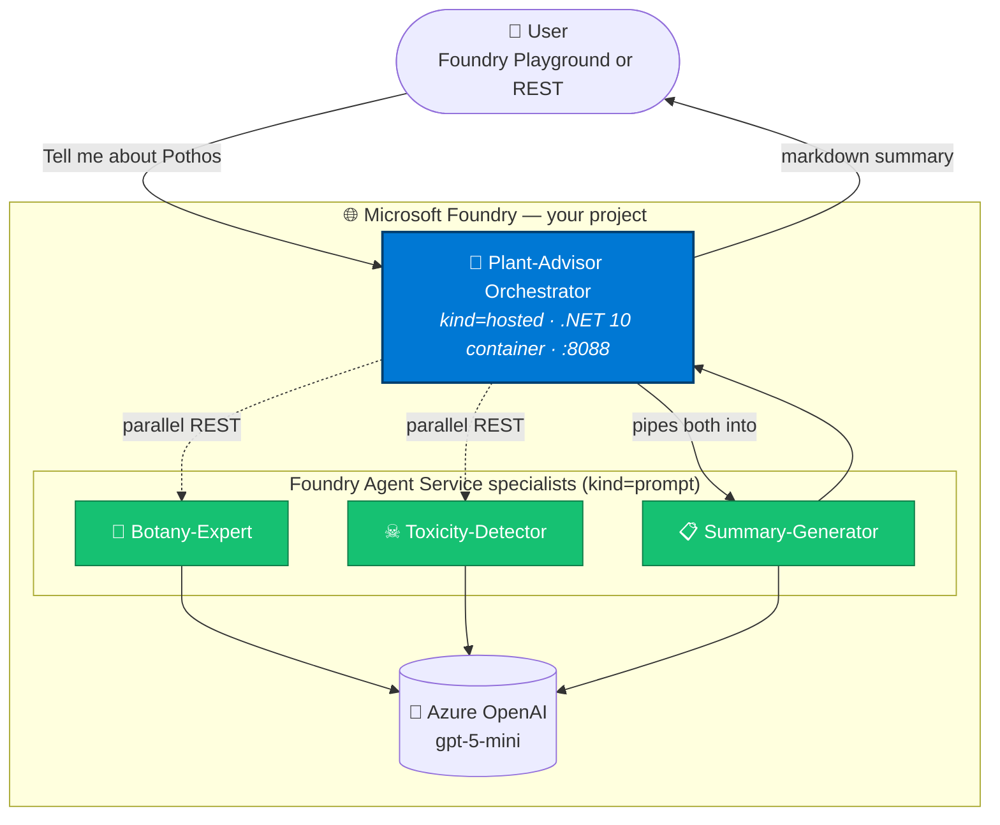

# 🌿 Foundry Multi-Agent Plant Advisor — .NET Accelerator

> A multi-agent system on **Microsoft Foundry** — one **Hosted Agent** orchestrator (.NET 10 container) coordinates **three Foundry Agent Service specialists** to answer any plant question with botany facts, toxicity warnings, and a friendly bulleted summary.

[](https://dotnet.microsoft.com/)
[](https://ai.azure.com)
[](#%EF%B8%8F-preview-feature-notice)
[](LICENSE)

---

## 🎬 The scenario

> *"I bought a beautiful Pothos plant. Is it safe for my cat? How do I care for it?"*

A plant lover wants quick, trustworthy answers. A single LLM call can hallucinate care tips or miss critical toxicity facts. We need **specialist knowledge** — a botanist, a toxicologist, and a writer — working together and giving one consolidated answer.

This accelerator shows how to build that team using **Microsoft Foundry's hosted agents + Agent Service** in .NET, end-to-end.

---

## 🤔 What problem does a Hosted Agent solve here?

A Hosted Agent is a **container** running **inside Foundry-managed compute**, exposing the standard **Responses API**. Compared to a single chat-completion call, it gives us:

| Capability | Why it matters here |
|------------|---------------------|
| **Custom orchestration code in .NET** | We need to call 3 sub-agents in parallel and merge results — the model alone can't do that reliably |
| **Managed identity + Foundry-managed runtime** | No keys, no infra to babysit, automatic Application Insights wiring |
| **Versioned deployments + rolling traffic** | Ship a new orchestrator version, A/B test, roll back |
| **Plays well with `kind=prompt` agents** | The 3 specialists are lightweight Agent Service entries (no containers); the orchestrator just REST-calls them |

The result: a **production-shaped, multi-agent template** you can fork and re-skin for any domain — legal, medical, finance, support — by swapping the 3 specialists' instructions.

> 🔤 **This accelerator is .NET 10**, but Foundry Hosted Agents are **container-based** so other languages work too:
> - ✅ **Officially supported via Microsoft Agent Framework adapters:** **.NET** (this repo) and **Python**
> - ⚪ **Possible with a custom HTTP server:** any runtime (Node.js, Java, Go, …) that implements the Foundry **Responses Protocol** on port `8088`
>
> The orchestration patterns, bicep, and deploy scripts in this repo translate directly — only `src/HostedAgent/` would change for a different language.

---

## ⚠️ Preview feature notice

> 🚧 **Microsoft Foundry Hosted Agents are in PREVIEW.**
> APIs, regions, SDK versions, and pricing may change without notice.
> Do **not** use this in production until the feature reaches GA.
> Track status at [learn.microsoft.com/azure/ai-foundry/agents](https://learn.microsoft.com/azure/ai-foundry/agents).

---

## 🏗️ Architecture



**One model, four agents, parallel fan-out** — the orchestrator calls Botany ‖ Toxicity in parallel, then pipes both into Summary. Total latency ~60-90 seconds end-to-end.

---

## 🎁 Live example output

User asks: *"Tell me about Pothos plant"*

```markdown
## Pothos (Epipremnum aureum)

**Quick facts**
• Family Araceae; native to the South Pacific (Solomon Islands)
• Excellent indoor houseplant; outdoors only in tropical regions
• Vigorous climber with many popular variegated cultivars

**Care essentials**
• Light: Bright indirect light; tolerates low light
• Water: Let top 2-5 cm dry between waterings
• Soil: Fast-draining mix with perlite + orchid bark

**Safety**
• Toxicity: MODERATELY TOXIC
• Risk to pets: Oral irritation, drooling, vomiting in cats/dogs
• Risk to humans: Immediate oral pain/swelling on ingestion

**Bottom line**
Great, easy houseplant — but keep out of reach of pets and toddlers.
```

Off-topic questions (weather, code, sports) get politely refused — the orchestrator is strictly scoped to plants.

---

## ⚡ Quick start

```powershell
git clone https://github.com/<your-username>/foundry-hosted-agent-quickstart
cd foundry-hosted-agent-quickstart
.\deploy.ps1
```

Answer 4 prompts → ~10 minutes later you have a working multi-agent system in Foundry.

📖 **Full step-by-step instructions:** see **[DEPLOYMENT_GUIDE.md](DEPLOYMENT_GUIDE.md)**

---

## ⚠️ Region limitation

Foundry Hosted Agents are **only** available in 4 regions today:

| ✅ Supported regions |
|----------------------|
| `swedencentral` *(recommended)* |
| `canadacentral` |
| `northcentralus` |
| `australiaeast` |

The deploy script hard-validates this for you.

---

## 📁 Project structure

```
foundry-hosted-agent-quickstart/
├── README.md                  ← This file
├── DEPLOYMENT_GUIDE.md        ← 📖 Full step-by-step deployment guide
├── BLOG.md                    ← Medium-ready long-form post
├── CONTRIBUTING.md            ← How to add a new specialist agent
├── LICENSE                    ← MIT
│
├── deploy.ps1                 ← 🚀 Main entry point (interactive)
├── deploy-agent.ps1           ← Agent-only steps (called by deploy.ps1)
├── setup-infra.ps1            ← Infra-only entry point
├── cleanup.ps1                ← Tear-down helper
├── azure.yaml                 ← azd configuration
│
├── infra/                     ← Bicep IaC
│   └── core/{ai,host,monitor,...}/
│
└── src/HostedAgent/           ← Orchestrator .NET 10 app
    ├── Program.cs             ← Top-level statements + GetPlantReport tool
    ├── PlantAgents.cs         ← REST client for sub-agents
    ├── Dockerfile             ← Multi-stage Alpine build
    └── HostedAgent.csproj
```

---

## 🚀 Extend it for your domain

Swap *plants* for **legal docs**, **medical guidelines**, **financial reports**, **recipes**, etc. by:

1. Editing the 3 system instructions in `deploy-agent.ps1` STEP 5
2. Updating the orchestrator's tool name + scope in `src/HostedAgent/Program.cs`
3. Re-running `.\deploy.ps1`

See [CONTRIBUTING.md](CONTRIBUTING.md) for a worked example (adding a 4th *Pricing-Estimator* specialist).

---

## 📚 Further reading

- 🌐 [Microsoft AI Foundry portal](https://ai.azure.com)
- 📖 [Foundry hosted agents docs](https://learn.microsoft.com/azure/ai-foundry/agents) *(Preview)*
- 🐙 [Azure-Samples / foundry-hosted-agents-dotnet-demo](https://github.com/Azure-Samples/foundry-hosted-agents-dotnet-demo) — reference scenarios
- 🤖 [Microsoft Agent Framework](https://github.com/microsoft/agent-framework)

---

## 📝 License

[MIT](LICENSE) — fork, remix, ship. Just don't blame us if your pothos still dies.

---

*Built with ❤️ using .NET 10, Azure AI Foundry hosted agents (Preview), and gpt-5-mini.* 🌱
